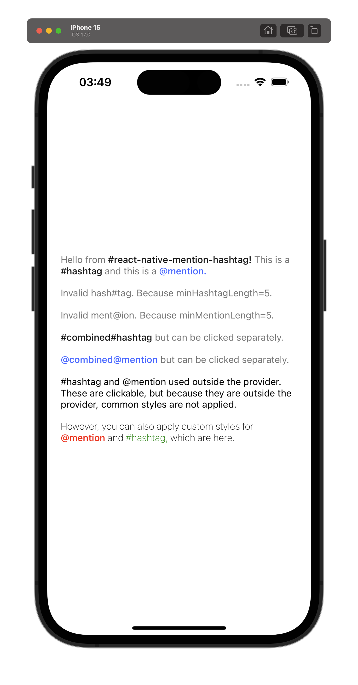

# React Native Mention Hashtag

This package allows you to capture mention (tagging) and hashtag elements within text in React Native applications. When a mention or hashtag is detected within the text, it calls the specified callback functions, providing customized functionality to the user.



## How to Use

### Installation

You can install the package in your project using npm or yarn:

```bash
npm install react-native-mention-hashtag
```

or

```bash
yarn add react-native-mention-hashtag
```

### Usage

This package provides two components named `MentionHashtagText` and `MentionHashtagProvider`. The provider component provides necessary properties such as onMentionPress and onHashtagPress, and these properties are passed to all `MentionHashtagText` components. However, the provider component is optional, and the `MentionHashtagText` component can be used directly without any component.

```tsx
import React from "react";
import { View } from "react-native";
import {
  MentionHashtagProvider,
  MentionHashtagText,
} from "react-native-mention-hashtag";

const MyComponent = () => {
  const handleMentionPress = (mention: string) => {
    console.log("Mention pressed:", mention);
  };

  const handleHashtagPress = (hashtag: string) => {
    console.log("Hashtag pressed:", hashtag);
  };

  return (
    <MentionHashtagProvider
      onMentionPress={handleMentionPress}
      onHashtagPress={handleHashtagPress}
    >
      <View>
        <MentionHashtagText>Hello @world #reactnative</MentionHashtagText>
      </View>
    </MentionHashtagProvider>
  );
};

export default MyComponent;
```

### Props

---

| Prop               | Description                                        | Default     | Example Usage                               |
| ------------------ | -------------------------------------------------- | ----------- | ------------------------------------------- |
| `onMentionPress`   | Callback function called when a mention is pressed | `undefined` | `(mention: string) => console.log(mention)` |
| `onHashtagPress`   | Callback function called when a hashtag is pressed | `undefined` | `(hashtag: string) => console.log(hashtag)` |
| `minHashtagLength` | Minimum length of a hashtag                        | 1           | 3                                           |
| `minMentionLength` | Minimum length of a mention                        | 1           | 5                                           |
| `mentionTextStyle` | Style object for mention text                      | `{}`        | `{ color: 'blue' }`                         |
| `hashtagTextStyle` | Style object for hashtag text                      | `{}`        | `{ color: 'green' }`                        |

The `MentionHashtagText` component inherits all props of the `Text` component in React Native, such as `style`, `numberOfLines`, `onLayout`, etc.

### Examples

#### Basic Usage

```tsx
<MentionHashtagText
  onMentionPress={(mention) => console.log("Mention pressed:", mention)}
  onHashtagPress={(hashtag) => console.log("Hashtag pressed:", hashtag)}
>
  Hello @world #reactnative
</MentionHashtagText>
```

#### Applying Styles

```tsx
<MentionHashtagText
  onMentionPress={(mention) => console.log("Mention pressed:", mention)}
  onHashtagPress={(hashtag) => console.log("Hashtag pressed:", hashtag)}
  mentionTextStyle={{ fontWeight: "bold", color: "blue" }}
  hashtagTextStyle={{ fontStyle: "italic", color: "green" }}
>
  Hello @world #reactnative
</MentionHashtagText>
```

#### Setting Minimum Lengths

```tsx
<MentionHashtagText
  onMentionPress={(mention) => console.log("Mention pressed:", mention)}
  onHashtagPress={(hashtag) => console.log("Hashtag pressed:", hashtag)}
  minMentionLength={3}
  minHashtagLength={2}
>
  Hello @world #reactnative
</MentionHashtagText>
```

---

The code of the example in the simulator image above:

```tsx
import { StyleSheet, View } from "react-native";
import {
  MentionHashtagProvider,
  MentionHashtagText,
} from "react-native-mention-hashtag";

export default function App() {
  return (
    <View style={styles.container}>
      <MentionHashtagProvider
        onHashtagPress={(hashtag) => console.log(hashtag)}
        onMentionPress={(mention) => console.log(mention)}
        /**
         * Custom styles for MentionHashtagText.
         */
        style={{ color: "gray", fontWeight: "400" }}
        /**
         * Custom styles for Mention.
         */
        mentionTextStyle={{
          fontWeight: "500",
          color: "#4073ff",
        }}
        /**
         * Custom styles for Hashtag.
         */
        hashtagTextStyle={{
          fontWeight: "500",
          color: "#181818",
        }}
        minHashtagLength={5}
        minMentionLength={5}
      >
        <MentionHashtagText>
          Hello from #react-native-mention-hashtag! This is a #hashtag and this
          is a @mention.
        </MentionHashtagText>
        <MentionHashtagText>
          Invalid hash#tag. Because minHashtagLength=5.
        </MentionHashtagText>
        <MentionHashtagText>
          Invalid ment@ion. Because minMentionLength=5.
        </MentionHashtagText>
        <MentionHashtagText>
          #combined#hashtag but can be clicked separately.
        </MentionHashtagText>
        <MentionHashtagText>
          @combined@mention but can be clicked separately.
        </MentionHashtagText>
      </MentionHashtagProvider>
      <MentionHashtagText>
        #hashtag and @mention used outside the provider. These are clickable,
        but because they are outside the provider, common styles are not
        applied.
      </MentionHashtagText>
      <MentionHashtagText
        mentionTextStyle={{
          fontWeight: "500",
          color: "red",
        }}
        hashtagTextStyle={{
          color: "green",
        }}
        style={{
          fontWeight: "200",
        }}
      >
        However, you can also apply custom styles for @mention and #hashtag,
        which are here.
      </MentionHashtagText>
    </View>
  );
}

const styles = StyleSheet.create({
  container: {
    flex: 1,
    backgroundColor: "#fff",
    alignItems: "center",
    justifyContent: "center",
    alignItems: "flex-start",
    paddingHorizontal: 20,
    gap: 16,
  },
});
```

These examples demonstrate different usage scenarios and features of the package. Feel free to apply these examples to your own project to better understand the package.
